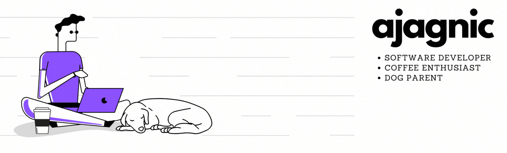
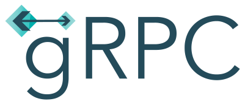
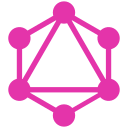

### Hello , I'm Adrian Agnic!

Software Developer specializing in Go and Python development and orchestration with Docker and Kubernetes. Professionally experienced with all the technologies listed in the __toolbox__ below.

- 🔭 I’m currently working on fun image-generation projects.
- 🌱 I’m currently learning some mind-boggling algorithms.
- 📫 How to reach me: 
    - Message/Follow me on [LinkedIn](https://www.linkedin.com/in/adrianagnic)!

--------
🧰 Toolbox

<!--
**ajagnic/ajagnic** is a ✨ _special_ ✨ repository because its `README.md` (this file) appears on your GitHub profile.

Here are some ideas to get you started:

- 🔭 I’m currently working on ...
- 🌱 I’m currently learning ...
- 👯 I’m looking to collaborate on ...
- 🤔 I’m looking for help with ...
- 💬 Ask me about ...
- 📫 How to reach me: ...
- 😄 Pronouns: ...
- ⚡ Fun fact: ...
-->
